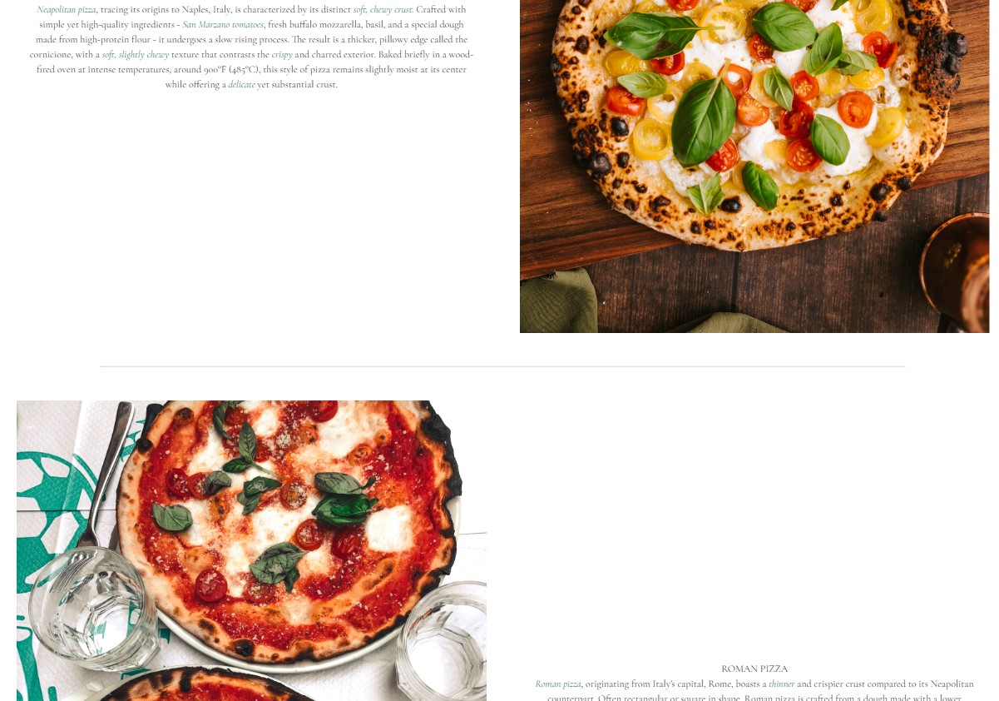

# Segreti Di Nonna - Authentic Pizza website

This repository contains code for Segreti Di Nonna, an immersive online resource providing insights into crafting authentic Neapolitan pizzas. The project focuses on revealing the secrets behind the rich history of these pizza styles while offering valuable guidance on creating the perfect pizza at home.

## Table of Contents

- [Segreti Di Nonna - Authentic Pizza website](#segreti-di-nonna---authentic-pizza-website)
  - [Table of Contents](#table-of-contents)
  - [Description](#description)
  - [Features](#features)
  - [Technologies Used](#technologies-used)
  - [Usage](#usage)
    - [Testing](#testing)
    - [Overview](#overview)
    - [Test Cases](#test-cases)
    - [Tools Used](#tools-used)
    - [Test Results](#test-results)
  - [Contact](#contact)
  - [Deployment](#deployment)
  - [Media](#media)
  - [HTML and CSS Validator](#html-and-css-validator)

## Description

Segreti Di Nonna is an online platform dedicated to sharing the traditional recipes and techniques for making Neapolitan and Roman pizzas. It provides historical background, detailed instructions, and tips for achieving the distinctive characteristics of each pizza style.

## Features

- Detailed information about Neapolitan and Roman pizzas
- Step-by-step guides for making authentic pizzas at home
- Responsive design for various devices
- Social media integration for sharing and engagement

## Technologies Used

- HTML5
- CSS3
- [Font Awesome](https://fontawesome.com/) for icons
- Google Fonts for typography
- Responsive design using media queries

## Usage

- Navigate through different sections using the top menu bar.
- Learn about the history and characteristics of Neapolitan and Roman pizzas.
- Follow the provided guides to try making these pizzas at home.
- Engage with social media for further updates and sharing.
Homepage: Offers foundational details and factual content to elucidate the website's purpose, complemented by visual imagery aimed at conveying its essence.

Bake Along Tab: Contains a detailed recipe for crafting authentic Neapolitan pizza.

Neapolitan Pizza Tab: Showcases a gallery of images displaying Neapolitan pizza in all its authenticity.

Roman Pizza Tab: Features a gallery displaying various renditions of Roman pizza.

About Tab: Houses information regarding the website's concept, its genesis, and the underlying ideology.

[Link to Am I Responsive Page](https://ui.dev/amiresponsive?url=https://augustsletto.github.io/segreti-di-nonna1/index.html)

Desktop Navbar

with responsive underline and color change on hover.

with working hamburger icon to toggle

Responsive photo gallery

_Bake along with instructions_

Featuring interactive videos demonstrating baking techniques for a hands-on learning experience.

_Footer with social media links_

Highlights on hover, bottom logo also works as a "home" button.

Lighthouse test

Scoring high as seen below.

### Testing

### Overview

The Segreti Di Nonna project underwent extensive testing to ensure its functionality across different devices, browsers, and screen sizes. The testing phase focused on assessing the performance, responsiveness, and overall user experience of the application.

### Test Cases

- **Responsiveness:** Verified the responsiveness of the website on various devices using manual testing and browser dev tools.
- **Cross-Browser Compatibility:** Checked compatibility across multiple browsers such as Chrome, Firefox, Safari, and Edge.
- **Feature Testing:** Conducted specific tests on individual features to ensure proper functionality.
- **Usability Testing:** Involved real users to assess the usability and navigation of the site.

### Tools Used

- **Google Chrome DevTools:** Used for inspecting elements, debugging, and testing responsiveness.
- **Manual Testing:** Thoroughly checked the user interface, functionalities, and behavior manually.

### Test Results

The project successfully passed all test cases and demonstrated consistent performance across different devices and browsers. Any reported issues were addressed and resolved.

## Contact

For any inquiries or feedback, feel free to reach out via email: [augustsletto@gmail.com](mailto:augustsletto@gmail.com)

## Deployment

I began by developing the code in Visual Studio Code (VS Code). However, for deployment purposes, I transitioned the project to CodeAnywhere and subsequently deployed it using GitHub's platform.

The deployed project can be accessed via the following link: 
[Segreti di Nonna](https://augustsletto.github.io/segreti-di-nonna1/index.html)

## Media

The images and videos were taken from
[Pexels](https://www.pexels.com/search/videos/neapolitan/)

---

## HTML and CSS Validator

Validator completed for all pages.

